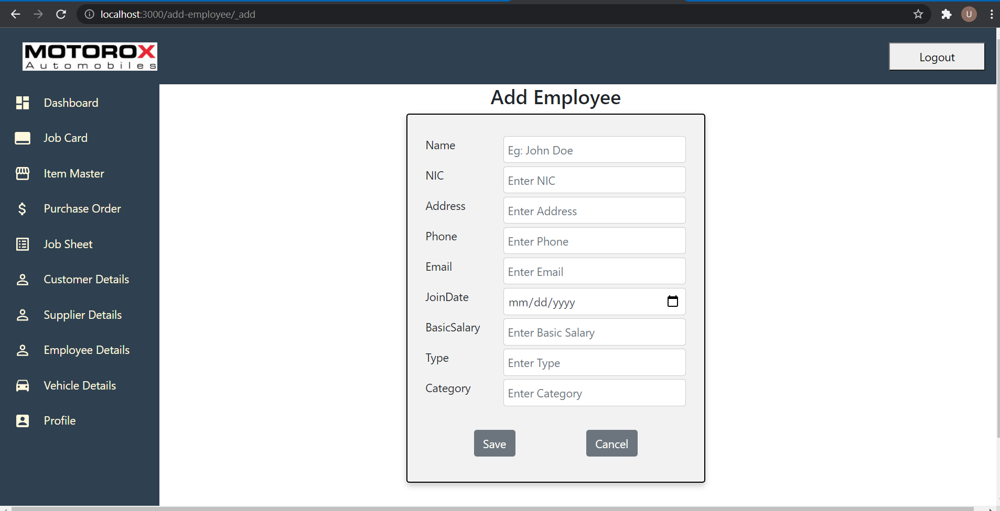
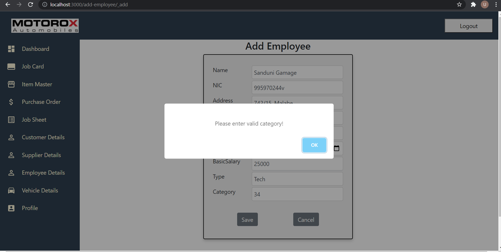
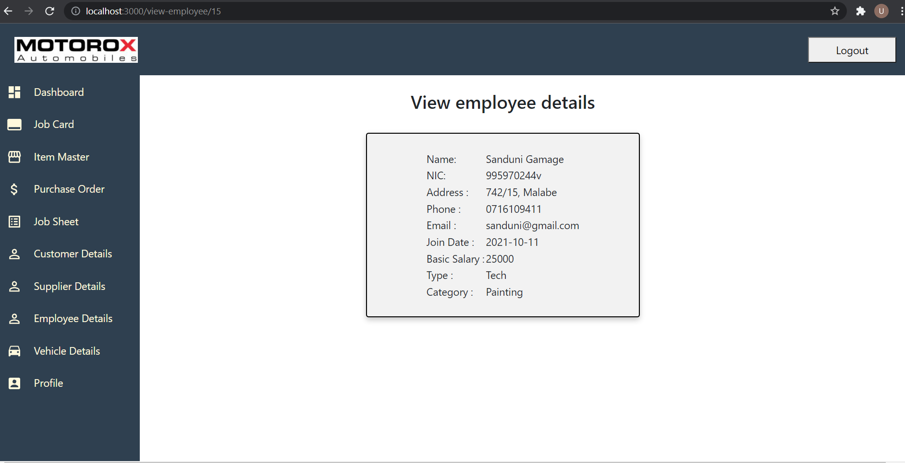
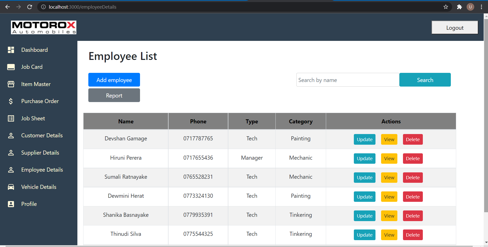
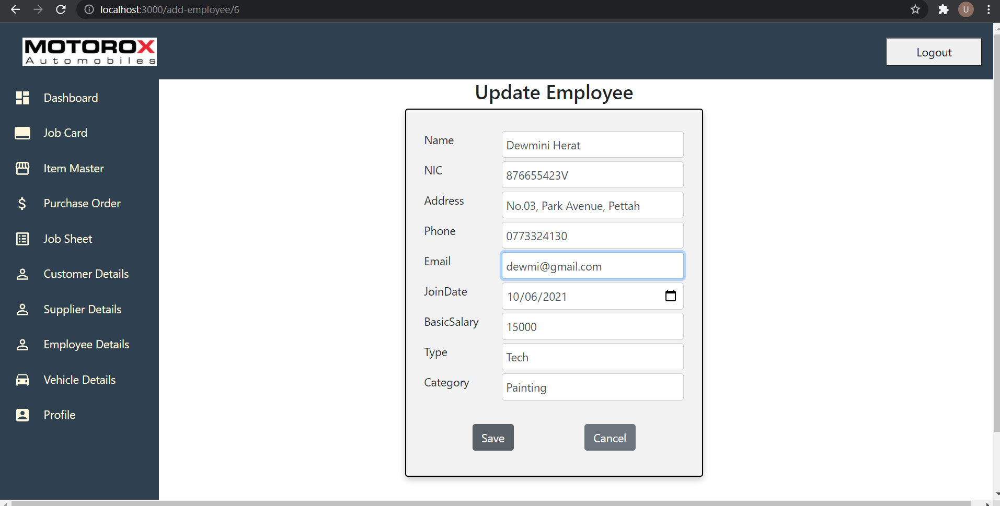
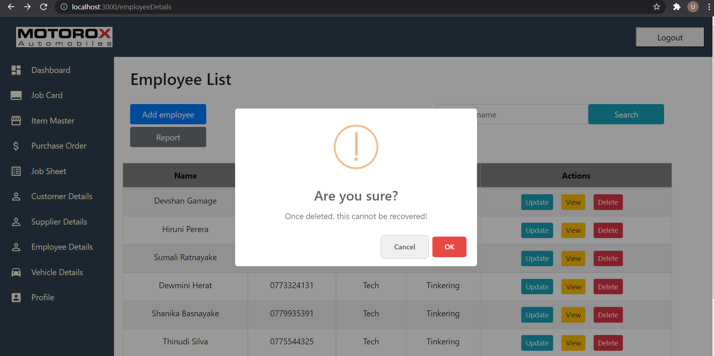
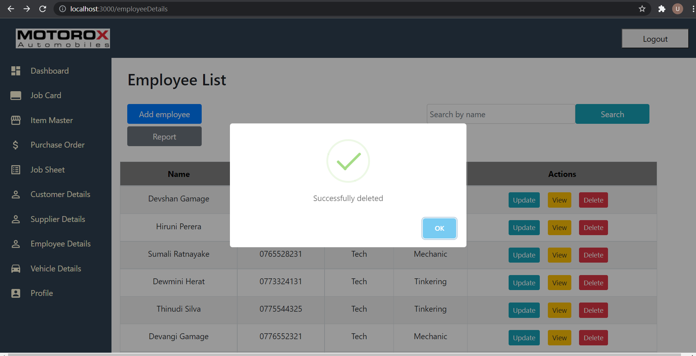
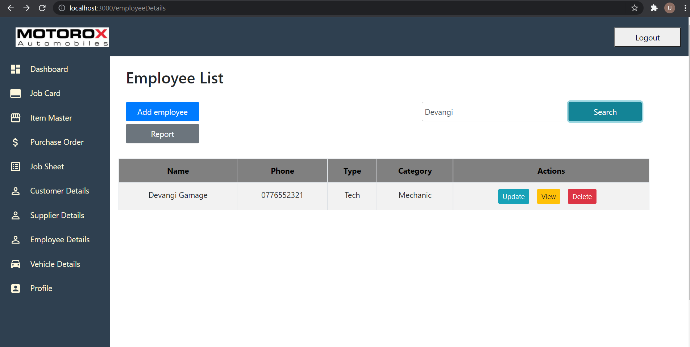
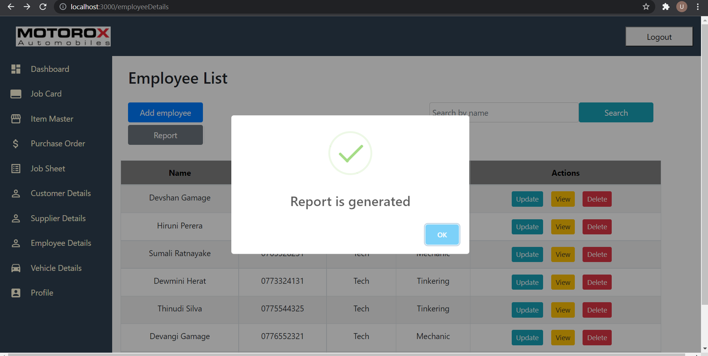
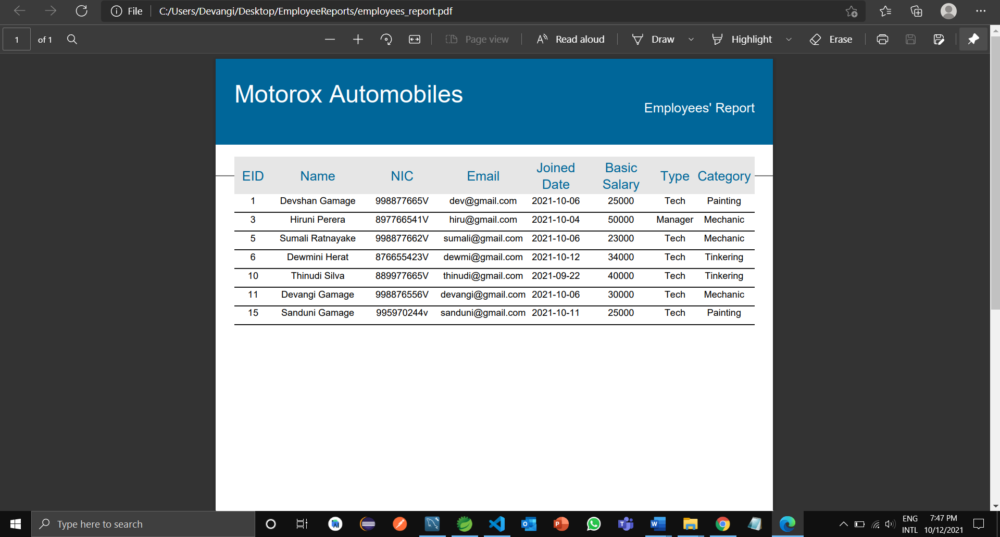

# MotoroxAutomobiles_Employee-Management
Web application for Motorox Automobiles (pvt) Ltd was developed for the 'Information Technology Project' module in 2nd semester of 2nd year. Customer, vehicle, employee, supplier, stock, inventory, job sheet and purchase order management functions were implemented by group members.

## Employee Details Management (Individual part)

### New employees are registered to the system by adding their details

   

### Those details can be viewed

   

### Updating details

   

### Details of resigned employees are removed from the system

   

### Admin can search employees when needed

   

### Generate reports of employee details as required

   

## Tools & technologies
- Backend - Spring Boot (IDE - Spring Tool Suite)
- Frontend - ReactJS (IDE - VS Code)
- Database - MySQL
- Reporting library - Jasper Reports
